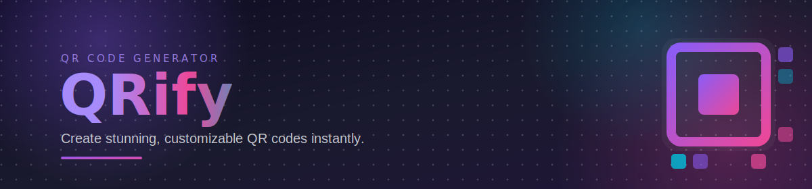

<p align="center">
  
</p>

<p align="center">
  
  
  
  
  
</p>

<p align="center">
  
  
  
</p>

<p align="center">
  <a href="https://qrmagicstudio.netlify.app/">
    
  </a>
</p>

<p align="center">
  <sub>
    <a href="#-features">Features</a> ·
    <a href="#-quick-start">Quick Start</a> ·
    <a href="#%EF%B8%8F-tech-stack">Tech Stack</a> ·
    <a href="#-project-structure">Project Structure</a> ·
    <a href="#-how-it-works">How It Works</a> ·
    <a href="#-license">License</a>
  </sub>
</p>

<p align="center">
  Transform any link into a beautiful, customizable QR code with modern templates, custom shapes, background styles, logo overlays, and instant multi-format export.
</p>

<div align="center">

⭐ **[qrmagicstudio.netlify.app](https://qrmagicstudio.netlify.app/)** — no install needed, just open and create

</div>

<br/>

## ✨ Features

<table width="100%">
  <tr>
    <td width="60" align="center">⚡</td>
    <td><strong>Instant Generation</strong><br/><sub>Create QR codes in milliseconds from any URL</sub></td>
  </tr>
  <tr>
    <td align="center">🎨</td>
    <td><strong>8 Beautiful Templates</strong><br/><sub>Classic Dark, Neon Purple, Ocean Blue, Sunset Glow, Forest Green, Midnight Gold, Pink Dreams, Cyber Tech</sub></td>
  </tr>
  <tr>
    <td align="center">🔷</td>
    <td><strong>8 Shape Patterns</strong><br/><sub>Square, Rounded, Dots, Diamond, Star modules with Leaf, Circle, Rounded eye styles</sub></td>
  </tr>
  <tr>
    <td align="center">🖼️</td>
    <td><strong>16 Background Templates</strong><br/><sub>Gradients, patterns, and textures — Purple Dream, Polka Dots, Circuit Board, and more</sub></td>
  </tr>
  <tr>
    <td align="center">🏷️</td>
    <td><strong>Logo Upload</strong><br/><sub>Drag & drop your custom logo into the center of the QR code with high error correction</sub></td>
  </tr>
  <tr>
    <td align="center">📤</td>
    <td><strong>Multi-Format Export</strong><br/><sub>Download as PNG, JPG, or PDF</sub></td>
  </tr>
  <tr>
    <td align="center">📱</td>
    <td><strong>QR Scanner</strong><br/><sub>Scan QR codes directly from your browser camera</sub></td>
  </tr>
  <tr>
    <td align="center">🌙</td>
    <td><strong>Dark Mode</strong><br/><sub>Gorgeous dark theme with animated gradient backgrounds</sub></td>
  </tr>
</table>

<br/>

## 🚀 Quick Start

```bash
# Clone the repo
git clone https://github.com/vishal-git-dot/qr-magic-studio.git

# Install dependencies
npm install

# Start the dev server
npm run dev
```

> 💜 Prefer not to install anything? **[Use the live app instead →](https://qrmagicstudio.netlify.app/)**

<br/>

## 🛠️ Tech Stack

<div align="center">

| Technology | Purpose | Category |
|:---|:---|:---|
| **React 18** | UI framework | Frontend |
| **TypeScript** | Type safety | Language |
| **Vite** | Lightning-fast bundler | Build Tool |
| **Tailwind CSS** | Utility-first styling | Styling |
| **shadcn/ui** | Beautiful UI components | Components |
| **qrcode.react** | QR code rendering | QR Engine |
| **qrcode** | Low-level QR data generation | QR Engine |
| **html-to-image** | QR code export | Export |
| **jsPDF** | PDF export | Export |
| **html5-qrcode** | Camera-based QR scanning | Scanner |

</div>

<br/>

## 📁 Project Structure

```
src/
├── components/
│   ├── BackgroundCard.tsx      # Background template cards
│   ├── FormatDialog.tsx        # Export format selection
│   ├── LinkInput.tsx           # URL input component
│   ├── LogoUpload.tsx          # Drag & drop logo upload
│   ├── PatternSelector.tsx     # QR shape pattern picker
│   ├── QRCodePreview.tsx       # QR code preview with overlays
│   ├── QRScanner.tsx           # Camera QR scanner
│   ├── StyledQRCode.tsx        # Custom canvas QR renderer
│   ├── TemplateCard.tsx        # Style template cards
│   └── ui/                     # shadcn/ui components
├── lib/
│   ├── backgroundTemplates.ts  # 16 background presets
│   ├── qrPatterns.ts           # Shape pattern definitions
│   ├── qrTemplates.ts          # 8 color templates
│   └── utils.ts                # Utility functions
├── pages/
│   ├── Index.tsx               # Landing page
│   └── Templates.tsx           # QR customization page
└── App.tsx                     # Router & providers
```

<br/>

## 🎯 How It Works

<div align="center">

```
  Enter URL  →  Choose Template  →  Customize Shape  →  Add Background  →  Upload Logo  →  Export
     🔗              🎨                  🔷                 🖼️                🏷️             📤
```

</div>

<br/>

## 📄 License

<p align="center">
  This project is licensed under the <a href="./LICENSE">MIT License</a> © QRify
</p>

<p align="center">
  <a href="https://qrmagicstudio.netlify.app/"><strong>🚀 Live Demo</strong></a> ·
  <a href="https://github.com/vishal-git-dot/qr-magic-studio">GitHub</a>
</p>

<p align="center">
  <sub>Built with 💜</sub>
</p>
